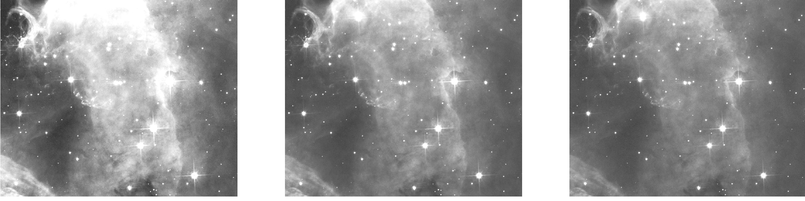

 <b>  Astro-U-net:  Learning to Enhance Astronomical Images </b> 

Astronomical images are essential for exploring and understanding the universe. Images often contains additive noise, which makes denoising mandatory step in post-processing data before further data analysis.  In order to maximise the efficiency and information gain in the post-processing of astronomical imaging, we decided to turn on machine learning. We propose \texttt{Astro U-net}, a fully-convolution neural network for image denoising and enhancement.

  
   

